> 做你自己的英雄
> ——鱼鱼的完美搜图教室

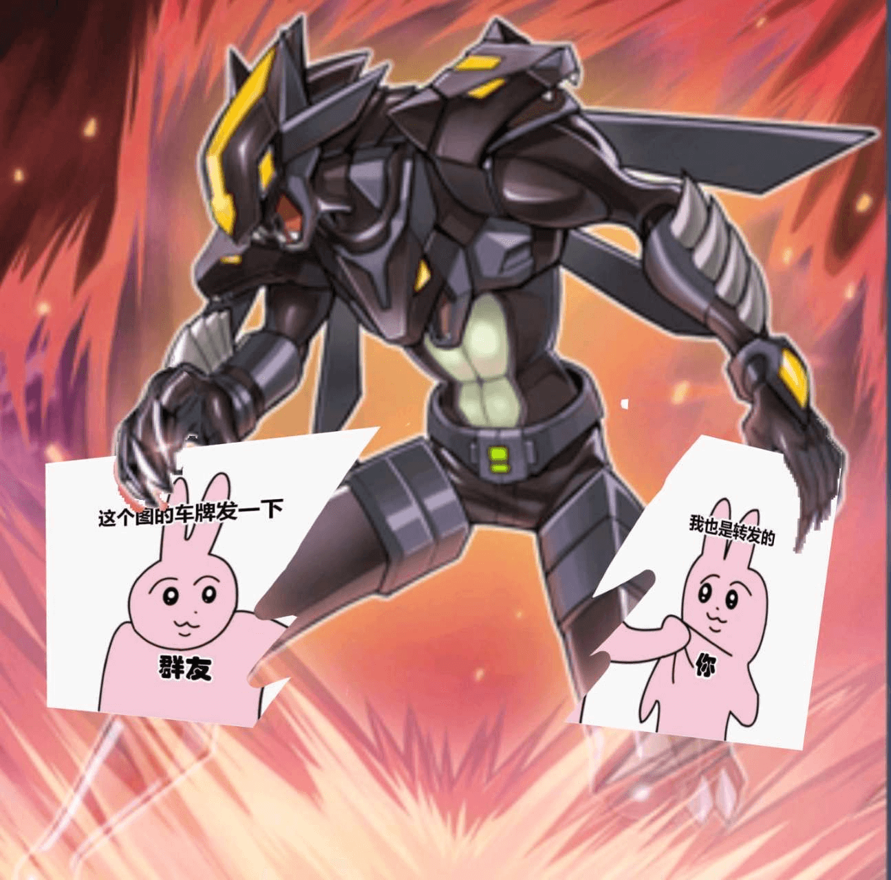
> 暗爪把转发不写出处的群友除外了，说：谢谢朋友侠

# 前言
涩涩是群聊文明的第一推动力，无论什么话题都有暂时停滞的时刻，惟有涩图永存。然而面对“我也是转发的”的赛博吟游诗人，不得来源的群友只好苦苦等待英雄的降临。有时能等到路过的好心人抛出链接，但更多时候只能等到一片寂静作结。

因此笔者权且抛砖引玉，介绍成为中国式英雄的几大助力。我称它们为『搜头四』，每个都有过人之处，每个都有独门绝招，速度和精准更是技惊四座，秘密武器更能给各位意外的惊喜。愿各位都能成为自己的英雄，也希望各位将来愿去做别人的英雄。

# 图片修饰
在使用任何搜图工具之前，一个应该了解的事实是：搜图引擎是以图片为单位进行搜索的。它们或许可以从残图中识别出原图，但很难从叠加或连缀的几张图片中找到你想找的那一张。因此，在搜索之前应当对图片做一定的修饰，比如简单的裁切、擦去多余的遮盖、利用如今许多手机自带的 AI 消除功能或者甚至自己画出缺失部分。最终，网站或 bot 的输入应当是无遮挡，尽量少马赛克，尽可能完整的单张图片——对于常以长图传播的漫画尤其如此。
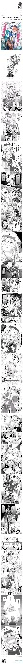
> 直接搜这种金箍棒的人应当为未来的 AI 叛乱负首要责任

# 工具介绍
获得一张适合的图之后，就是搜图的环节。下文将介绍常用的搜图方法，排名不分先后。

## 图片完整清晰时最好的选择——Sauce NAO
地址：https://saucenao.com/
::: tip 优点
搜索范围相对广，囊括 Pixiv，twitter，DeviantArt 以及 Artstation 上的内容。完整的漫画截图大多也能搜到漫画名称。
:::

::: warning 缺点
对于残图搜索能力较差；图片太新也可能会爬不到。
:::

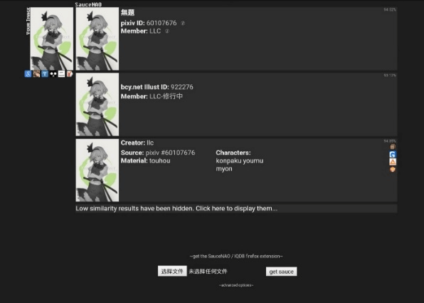
> 搜图工具正确使用范例

## 搜索残缺插画的强力工具——ascii2d 
地址：http://www.ascii2d.net/
简介：对二次元图片有相当强的搜索力，尤其对剪裁过的局部图片有相当不错的表现。因此相当多的群聊搜图 bot 也都挂载在此处。根据图片的不同可以选择使用“色合検索”或“特徴検索”。ascii 也提供了“詳細登録”功能，允许用户为图片添加注解。如果以后你用它以外的方式找到了来源，不妨回头添上两笔。

::: warning 缺点
对漫画的效果不是太好，但不妨一试。
:::

## 辅助其他网站的后备方案——Yandex
地址：https://yandex.com/images/touch/
简介：毛子的东西有不少都挺好使，比如 Yandex。可以用来搜索三次元（如 cosplay）图片或是残图。对于后者的效果往往能让你找到全图（或至少更完整一些的图），这时再使用其他引擎或许就能找到来源。常作为迭代搜图的中继使用。
::: warning 缺点
结果范围过大，一般不能直接给出图的最初来源。
:::

## 偶见奇效的万能手——Google 搜图
地址：https://www.google.com/imghp
简介：作为世界最大的搜索提供商，Google 能够找到相当数量的有关信息。不仅能像 Yandex 一样辅助，更是可以寻找是否有人曾搜过相同的图。若是图片完整有时也能直指来源。在其他网站失效时也可作为最后解决方案，有时能起到奇效。默认是先进 Google Lens 界面，可操作选框进行比对。也可点击搜索全图。
::: warning 缺点
识别成功率较其他网站略低，且手机访问时需改浏览器设置为显示桌面版网站才有以图搜图入口。
:::

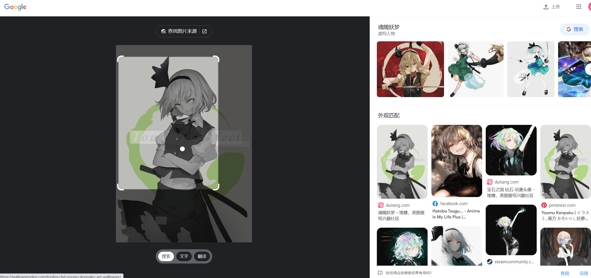
> 这↑里↓ 就是全图搜索了

## 唯一指定动画搜索器——trace.moe
地址：https://trace.moe/
简介：有一帧截图便可找到出处动画，表里不拘。是笔者所知最好且唯一的动画搜索网站。
::: tip 提示
要注意 NSFW 结果默认隐藏，需在结果下拉到底后手动展开。
:::

::: warning 缺点
由于动画所含图片数量级过大，几乎任何遮挡过的或是部分的截图都无法找到正解，此时可使用前述网站辅助。
:::
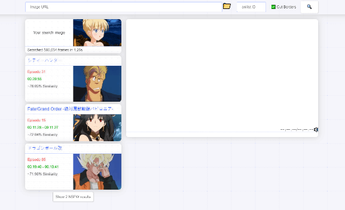
> 所以不要第一眼没看到结果就说网站没用啦

## 残缺表情包的超人——搜图 bot 酱
地址：https://soutubot.moe/
简介：最难搜索的图片莫过于群里流传的本子截图表情包。它们往往又小又难认，清晰度更是不能指望。搜图 bot 对于这些东西有其他网站望尘莫及的搜索力，一般都能找到。此网站有 telegram 频道可用，手机端可省去切换桌面版网站之烦。
::: warning 缺点
搜索范围基本限于 Nhentai 和 Ehentai 两个站点，因此表漫搜不到是很正常的。
:::

## 姹紫密麻麻石蜡——百度识图
地址：https://image.baidu.com/?fr=shitu
简介：前文所述网站都较难搜到国内平台（微博、Bilibili、Lofter 等）上的图片。百度搜图提供了一条搜索国内图片的渠道。
::: warning 缺点
话虽如此连自家的贴吧尚且不能搜出，基本上屁用没有。建议作为死马当活马医的最后一次尝试——万一就成了呢。
:::

## 机器学习怎比得上久经锻炼的肉体——一眼丁真
地址：你的海马体
简介：图片看得多了，自然能识别图中的角色以及各位画师的画风——又或者抢在询问者之前看过原图。此种方法无甚诀窍可言，只是看得多了便会。若是图上横陈“别急”或马赛克极严，又或裁切极小，这就是唯一的方法了。
::: warning 缺点
难度实在有些太高。笔者自助人搜图以来，凡遇 pixiv 上画风所喜者便关注其作者，至今已有三千之数。但仍不敢说能用此法搜出过几张图。
:::
> 【这里应该有一张全是色块组成的 96350977 或 84717407，奈何我找不到了】
> 这就是只能靠自己的时候了

## cy，求大佬私发，好人一生平安
地址：禾野吧、南+、河坝……
简介：单丝不成线孤木难成林，英雄也总有折戟的时候。不妨张帖于四方，天下总有识货的能手。等待下去总会有奇迹发生。
::: warning 缺点
听天由命。
:::
# 课后练习（大嘘）
好了，想必大家都已经完全掌握了，不妨现在就用这几张图试试手。以本文所述的方法，应当能找到下列 12 张图片的出处。能做到这一步，就是将笔者所知尽数学去了。网海广大，我所知不过九牛一毛，能对读者有所帮助就再好不过了。希望读到此处的你以后能在浏览时顺手留下别人询问的结果。我们发送的每一条回复，都是对世上另一人的一份祝福。

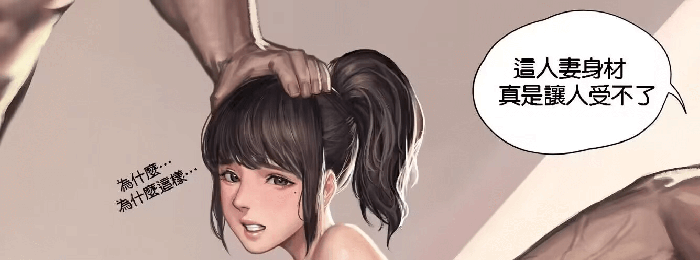
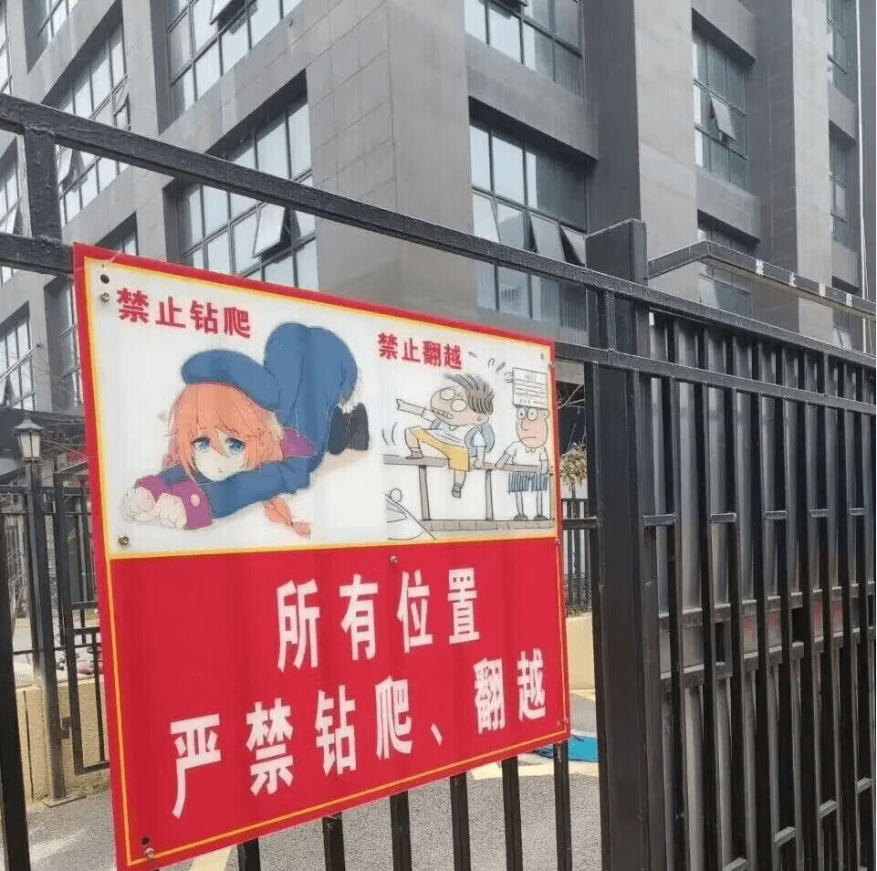
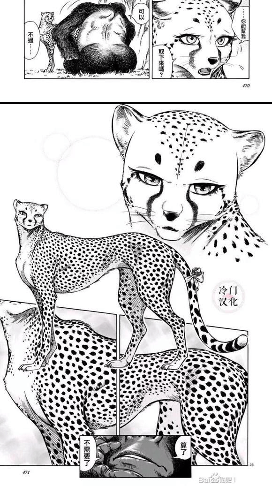
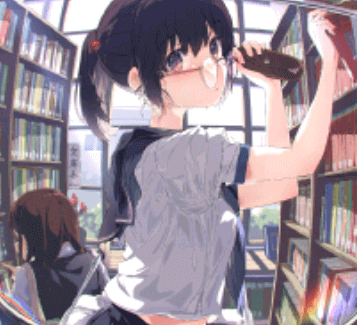
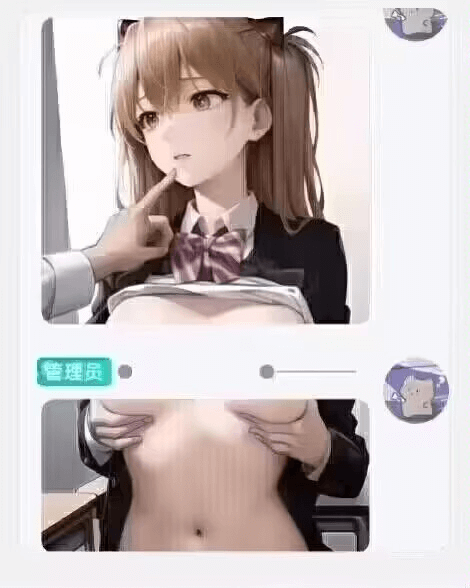
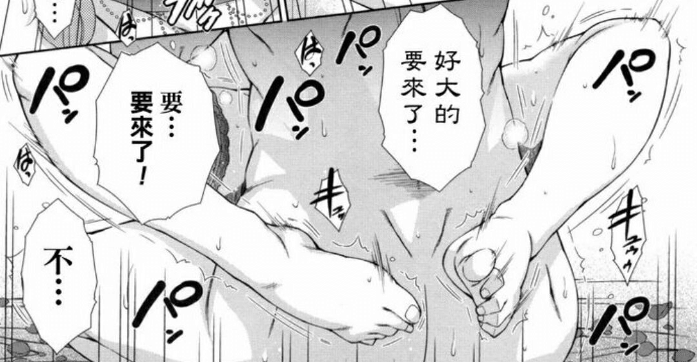
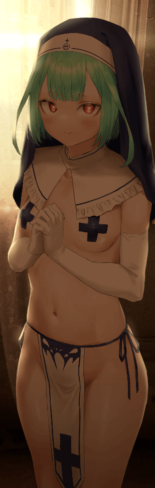
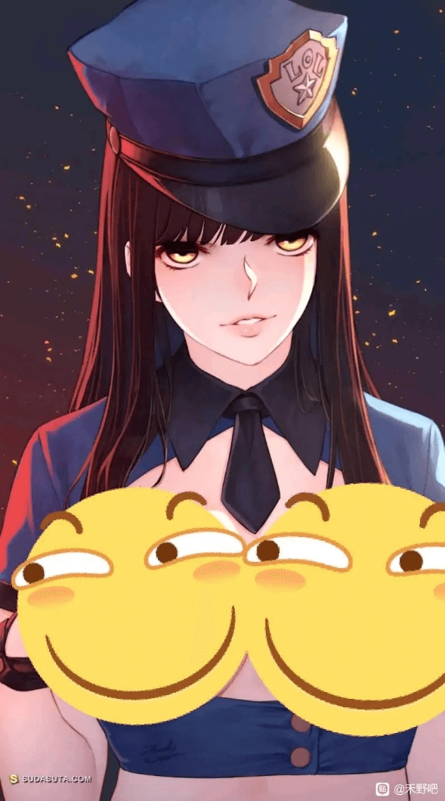
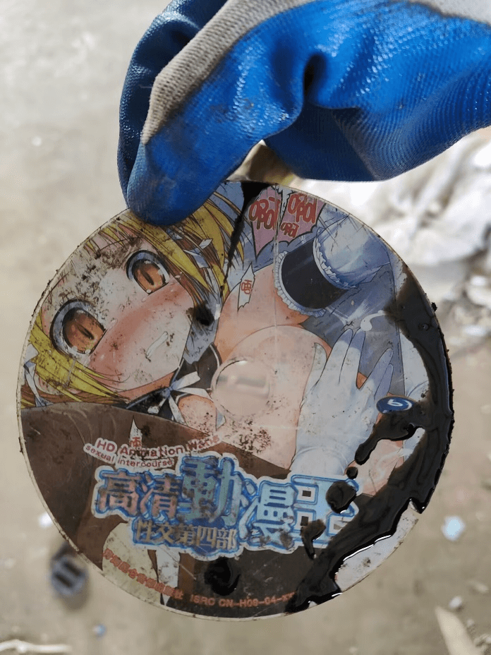

